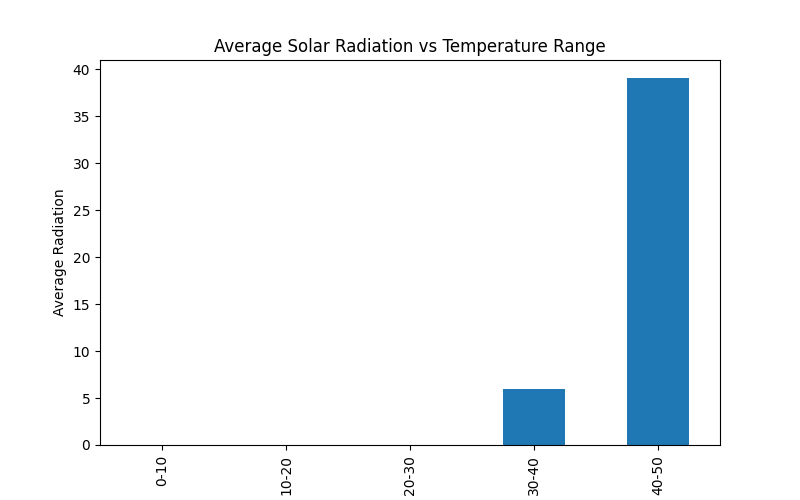
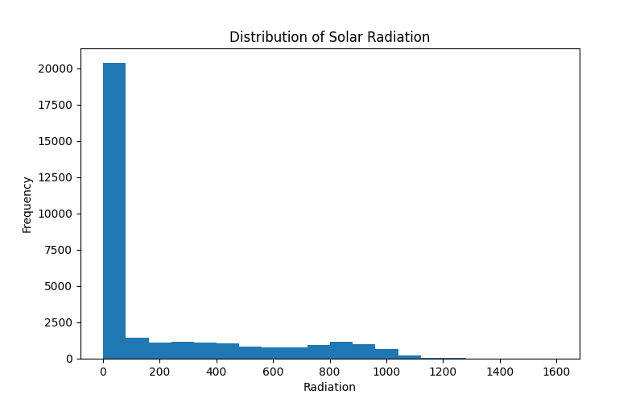
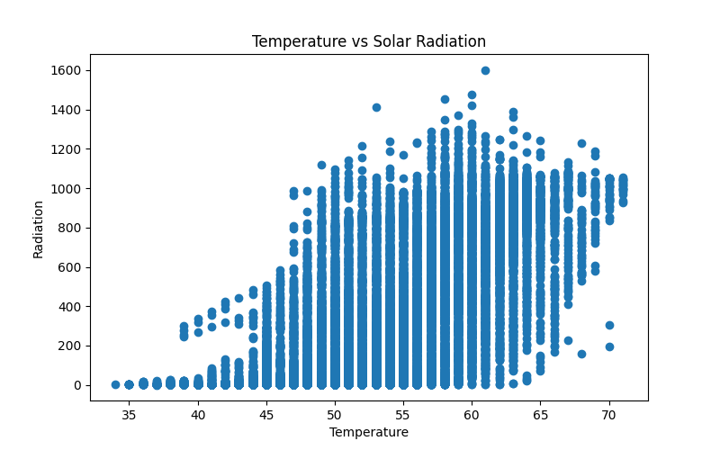
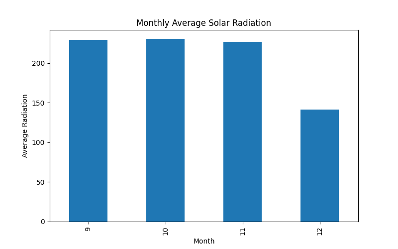

# Solar Radiation Data Analysis using Python

## Overview

Solar radiation is a key environmental variable that influences solar energy generation, atmospheric processes, and climate studies. Understanding how solar radiation varies with temperature and time can provide useful insights for renewable energy applications and environmental analysis.

This project performs **Exploratory Data Analysis (EDA)** on a solar radiation dataset to investigate patterns, distributions, and relationships between environmental variables. The analysis focuses on identifying how radiation varies with temperature and how seasonal trends influence solar radiation levels.

All analyses were conducted using Python and fundamental data science libraries, with results presented through clear and interpretable visualizations.

---

## Objectives

The primary objectives of this project are:

* To explore the statistical characteristics of solar radiation data
* To investigate the relationship between temperature and radiation levels
* To analyze how solar radiation varies across different temperature ranges
* To observe seasonal trends in solar radiation using monthly aggregation
* To demonstrate basic exploratory data analysis techniques used in data science

---

## Technologies Used

The analysis was performed using the following tools and libraries:

* **Python**
* **Pandas** – Data manipulation and analysis
* **NumPy** – Numerical operations
* **Matplotlib** – Data visualization
* **Jupyter Notebook** – Interactive data analysis environment

---

## Dataset Source

The dataset used in this project was obtained from the data science platform Kaggle.

Kaggle provides a large collection of publicly available datasets used widely in data science research, machine learning experimentation, and academic projects.

Dataset: Solar Radiation Dataset

---

## Exploratory Data Analysis

The project performs several exploratory analyses to understand the structure and patterns present in the data.

### 1. Average Solar Radiation vs Temperature Range

Temperature values were grouped into discrete ranges to analyze how average solar radiation changes across different temperature intervals. This helps in understanding whether higher temperatures correspond to higher radiation levels.

### 2. Distribution of Solar Radiation

A histogram was generated to examine how radiation values are distributed across the dataset. This visualization helps identify the most common radiation levels and detect potential outliers.

### 3. Temperature vs Solar Radiation Relationship

A scatter plot was used to visualize the relationship between temperature and radiation. This analysis helps determine whether a positive correlation exists between these two variables.

### 4. Monthly Average Solar Radiation

Radiation values were aggregated by month to observe seasonal trends. This allows us to identify periods of higher or lower solar radiation across the year.

---

## Results

### Average Radiation vs Temperature Range

### Solar Radiation Distribution

### Temperature vs Solar Radiation

### Monthly Average Solar Radiation

---

## Key Insights

The exploratory analysis revealed several interesting patterns:

* Solar radiation generally increases with temperature, suggesting a positive relationship between these variables.
* Most radiation observations fall within a moderate range, with fewer extreme values.
* Scatter analysis indicates that higher temperature conditions often correspond to increased radiation levels.
* Monthly aggregation reveals seasonal variation in radiation, which is expected due to changes in solar exposure throughout the year.

---

## Author

**Zafir Ashraf Beigh**

